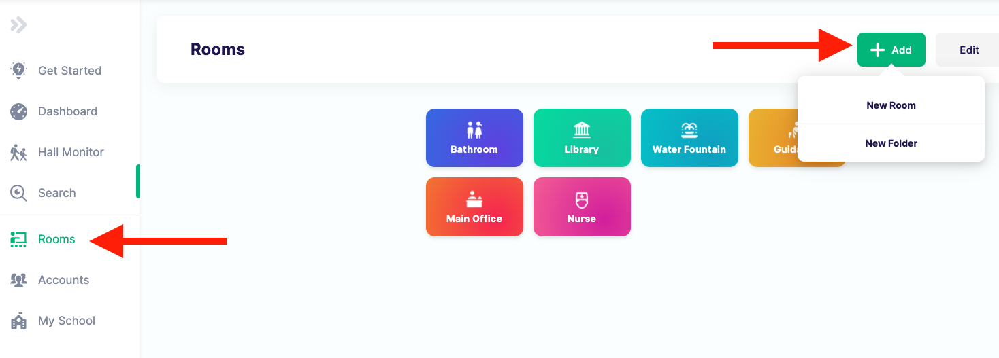

# Add and configure rooms

Use this instructional guide to add and configure rooms in SmartPass. It will serve as a starting point for your room
setup. Later on, you can customize it to your needs. In this guide we will:
- Upload all classrooms into a folder using a spreadsheet
- Add individual rooms as it's own tile
- Customize advanced settings

If you need help at any step email your tech representative, or checkout our [documentation on rooms](https://www.smartpass.app/support#rooms).

### Ensure all of your teacher accounts have been added
One of the important steps in room setup is assigning teachers to their respective rooms. Teacher accounts need to be
imported before this can be done. Ensure that you have already added all your teachers to SmartPass.

### Use folders to bulk add your classrooms
Folders are a great way to organize rooms and make it easy for students to find the rooms they need. We will first
upload all of your classrooms (rooms where teachers teach) into SmartPass.

> #### SPTodo:: Add a classroom folder
> 1. Sign into SmartPass with an admin account -> [www.smartpass.app/app](https://www.smartpass.app/app)
> 2. Go to the room tab on the left and hit the plus button. Then, select `New Folder`.
> 
> 3. Name the folder Classrooms, give it a color, search for and pick an icon.
> 4. Hit the `Import Rooms` button and download the spreadsheet. Fill it with the required Name, Room #, and assigned
>    teacher emails. Then upload it in the box.

>    Note: Importing rooms can be a little tricky, if you're having issues contact your tech rep.
>
> 5. Hit save in the top right corner
> 
> **Tip:** Can't see the save button? Make sure you've added a name and selected a color and icon.

### Add other rooms
Next, add any other rooms you would like to show as it's own individual tile. 

For example, add a Main Office, Nurse, or
Library. If you want to have a room for each Bathroom in your school (Eg. West Bathroom, East Wing Bathroom), we
recommend creating a folder just for bathrooms for easy access.

### Room advanced options
If you click into a specific room, you will be able to see advanced options. Read about what you can set on [our support article](https://www.smartpass.app/support/admin-room-options).