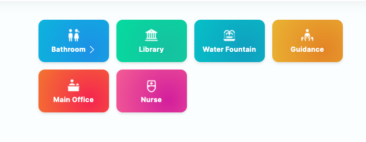
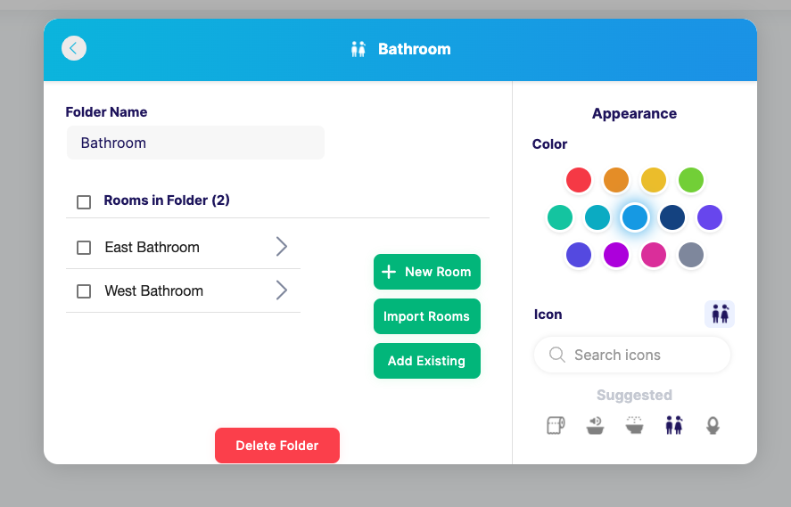

### Add other rooms
Next, add any other rooms you would like to show as it's own individual tile. 

For example, add a Main Office, Nurse, or
Library. If you want to have a room for each Bathroom in your school (Eg. West Bathroom, East Wing Bathroom), we
recommend creating a folder just for bathrooms for easy access.

### Room advanced options
If you click into a specific room, you will be able to see advanced options. Read about what you can set on [our support article](https://www.smartpass.app/support/admin-room-options).