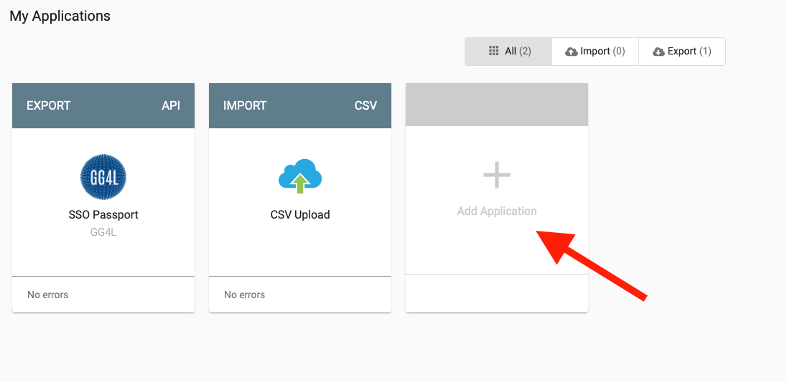
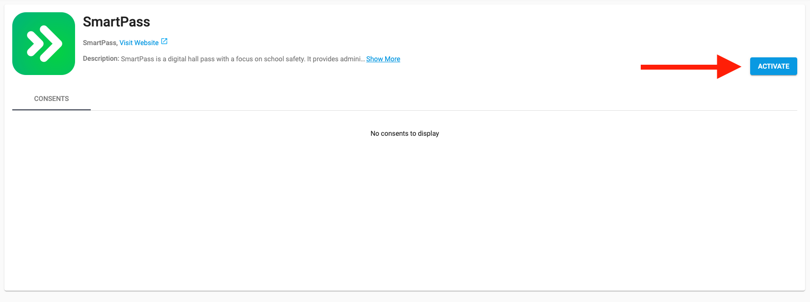

# Adding SmartPass to GG4L

If you have signed up with GG4L already, follow these steps to add SmartPass to GG4L Connect.

First we will activate SmartPass in GG4L Connect.
> #### SPTodo:: Activating SmartPass in GG4L Connect
> 1. Sign into [GG4L Connect](https://gg4l.edutone.net/) with a GG4L admin account.
> 2. Click `Add Application`
>    
> 3. Search for SmartPass in the application list along the top bar, then click `ACTIVATE`
>    
> 4. Select the schools that SmartPass should have access to.
> 5. Briefly look over the attributes. The values we require have been pre-selected for you. Contact us with any
>    questions on how we use a particular attribute. 
> 6. Set an expiration time.
> 7. Click `ACTIVATE` again at the bottom. In the pop up, enter the name of the schools that you have purchased SmartPass for. Then hit `SEND REQUEST`

Once you have submitted a request to add SmartPass through GG4L Connect, your tech contact will reach out to you once
the request has been approved and your accounts have been synced.